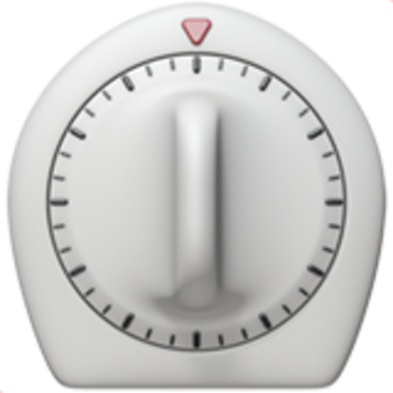

# Timely Tab Terminator

A Firefox extension that automatically closes idle tabs to keep your browser clean, with a whitelist, tab-count threshold, tab-group protection, and dark/light mode.

## Features

- **Auto-cleanup** — closes tabs that have been idle longer than a configurable limit, running silently in the background every minute
- **Tab threshold** — only triggers cleanup when you're over a set number of open tabs; set to `0` to always close idle tabs regardless of count
- **One-time sweep** — the **Run now** button closes all tabs *open* longer than a separate hard limit, ignoring the tab count entirely. It works even when automatic cleanup is switched off
- **Whitelist** — domains listed here are never closed; subdomains are matched automatically (`example.com` also protects `app.example.com`). Non-website pages (`about:…`, extensions, local files) are always protected
- **Current tab info** — shows the active tab's hostname, how long it has been open, and how long it has been idle
- **Open tab list** — scrollable list of all tabs sorted by longest-open first (active tab last). Shows each tab's open age; hover a tab for its idle time. Whitelisted tabs are marked ★, and tabs unloaded by Firefox are marked 💤
- **Tab age that survives restarts** — each tab's open-time is stored on the tab itself using Firefox's session storage, so ages survive tab unloading, closing and restoring tabs (Ctrl+Shift+T), and browser restarts
- **Pinned & audible tab protection** — optionally include or exclude pinned tabs and tabs playing audio
- **Dark / light mode** — toggle with the 🌙 / ☀️ button; preference is saved
- **Support for Tab Groups** — tabs in a tab group are never closed automatically. A collapsible groups section in the popup lets you view each group and how long its tabs have been open

## Installation

### From Firefox Add-ons (AMO)

Search for **Timely Tab Terminator** on [addons.mozilla.org](https://addons.mozilla.org) or install directly from the listing page.

### Manual (temporary, for development)

1. Clone or download this repository
2. Open Firefox and navigate to `about:debugging#/runtime/this-firefox`
3. Click **Load Temporary Add-on…**
4. Select the `manifest.json` file inside the `timely-tab-terminator/` folder

Temporary installs are removed when Firefox closes. For a persistent install, use the signed version from AMO.

## Settings

| Setting | Description |
|---|---|
| **Enabled** | Enable or disable automatic cleanup. (**Run now** still works while off — this switch only controls the automatic sweep.) |
| **Idle limit** | Minutes a tab must be idle before it's eligible for cleanup |
| **Keep at least** | Minimum number of tabs to keep open; set to `0` for no floor |
| **Pinned** | If checked, pinned tabs are eligible for cleanup |
| **Audible** | If checked, tabs playing audio are eligible for cleanup |
| **Run now also closes tabs older than** | When manually running cleanup, also close any tab that has been *open* longer than this many minutes — regardless of tab count or recent use |
| **Whitelist** | One hostname per line; matching tabs are never closed |

## How tab tracking works

- **Open age** — when a tab first appears, its open-time is written onto the tab via Firefox's `sessions` API. Because the data lives with the tab's session identity, it survives tab unloading, undo-close, and browser restarts (when Firefox restores your session).
- **Idle time** — taken from Firefox's own "last accessed" timestamp for each tab, so it stays correct across unloads and restarts too. "Idle" means *not selected or visited by you*; a tab that refreshes itself in the background still counts as idle.
- **Unloaded tabs** — Firefox may unload inactive tabs to save memory. They stay in your tab bar, keep their age, and show a 💤 in the popup.

### Known limitations

- Dragging a tab into another window can reset its recorded open age (Firefox drops the tab's stored data when it moves between windows).
- In private windows, ages persist only until the window closes (Firefox never persists private session data).
- If Firefox is set not to restore tabs on startup, ages start fresh after a restart — the tabs themselves are new in that case.

## Privacy

Timely Tab Terminator collects no user data. Settings and the whitelist are stored locally in `browser.storage.local`; per-tab open-times live in Firefox's per-tab session storage. Nothing is ever transmitted anywhere — no analytics, no external requests. The manifest declares no data collection permissions.

## Requirements

- Firefox 140 or later (required for Firefox data-collection permission disclosure support and Tab Groups support)

## License

MIT